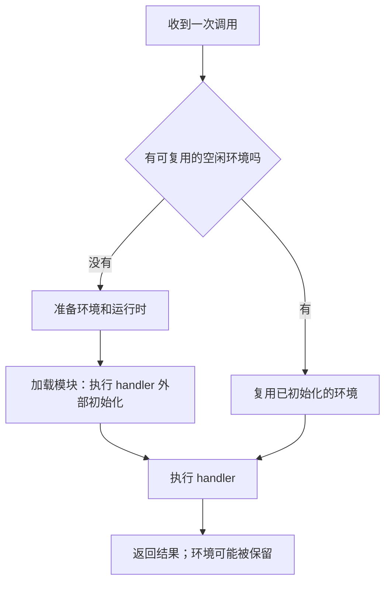
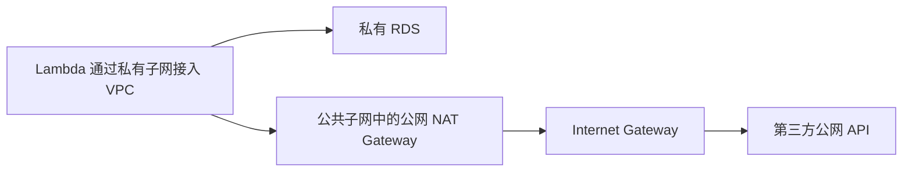

# Day 1｜从一次调用开始，读懂 AWS Lambda

> 对照目标：[Day 1 任务清单](../../Goal/Day%201.md) · 配套操作：[实验教程](tutorial.md) · [练习源码](src/index.mjs)
>
> 范围：DVA-C02 计划中的常规 Lambda 函数；本章不展开 Managed Instances、Durable Functions 等其他执行模式。
>
> 文档核对日期：2026-09-12。带“展开理解”的内容可在有疑问时再读。

## 0. 今天怎么读

今天围绕一段很小的程序学习：读取环境变量、给计数器加一、检查临时文件，再把结果返回。你已经做过这个实验，接下来把看到的现象和背后的规则连起来。

建议约 60–75 分钟读第 1–8 节，约 10 分钟做核心实验，10 分钟回答自测。其余时间用于原计划中的专项题和错题记录；第一次不必点开每条官方链接。首次创建资源、安装工具的时间另计。

| 读完要能解释的问题 | 阅读位置 |
| --- | --- |
| 为什么计数器有时会接着增加？ | [执行环境](#execution-environment) |
| 为什么加内存有时反而省钱？ | [内存与性能](#memory) |
| 限制并发与提前预热有什么区别？ | [并发](#concurrency) |
| 函数失败后谁重试，记录去哪？ | [调用与失败处理](#invocation) |
| 为什么配置 VPC 后访问公网超时？ | [VPC](#vpc) |
| 怎么只让少量请求使用新版代码？ | [版本与 Alias](#versions) |
| 环境变量、Layer、Extension 分别有什么用？ | [其他配置](#configuration) |

原 Goal 中的基线校准已经勾选完成，沿用那份薄弱服务清单即可。本文末尾提供逐项覆盖表。

<a id="fundamentals"></a>

## 1. 先分清：函数、调用和执行环境

### 1.1 Lambda 在替你做什么

假设要实现“用户上传照片后生成缩略图”。你写处理照片的代码；Lambda 在事件到来时准备运行代码的计算环境，并调用你的入口函数。

这里有三个不同的东西：

- **函数（Function）**：AWS 中的资源，包含代码、运行时、内存、超时等配置，例如 `dva-lab-day1-context`。
- **调用（Invocation）**：代码执行了一次。点击三次 Test，就是发起三次调用。
- **执行环境（Execution environment）**：真正运行代码的隔离空间，里面有语言运行时、内存和临时磁盘。同一函数可以有多个环境。

可以把函数理解成“菜谱”，调用是“做一份菜”，环境是“工作台”。同一份菜谱可在多张工作台上使用；某张工作台也可以连续做很多份菜。

这个比喻只帮助理解关系。实际环境由 AWS 管理，不能当成自己长期持有的一台服务器。[官方：Lambda 如何运行代码](https://docs.aws.amazon.com/lambda/latest/dg/concepts-how-lambda-runs-code.html)

### 1.2 `handler(event, context)` 到底是什么

这是概念示例，实验使用配套源码：

```javascript
export const handler = async (event, context) => {
  const name = event.name ?? "同学";
  console.log("本次调用编号：", context.awsRequestId);
  return { message: `你好，${name}` };
};
```

| 写法 | 怎么理解 |
| --- | --- |
| `export` | 导出函数，让运行时能找到它 |
| `handler` | 每次调用的入口；名字须与运行时设置一致 |
| `async` | 函数返回 Promise，可用 `await` 等待异步工作完成 |
| `event` | 本次业务输入，例如测试事件 `{"name":"小张"}` |
| `context` | Lambda 提供的本次调用信息，例如请求 ID、版本、剩余时间 |
| `return` | 把处理结果交还运行时 |

文件叫 `index.mjs`、导出函数叫 `handler`，Handler 配置就是 `index.handler`：前半段找文件，后半段找函数。

资料里的 **execution context** 通常在讲运行环境及其可复用资源；参数 **`context`** 是本次调用的信息对象。两者不能直接画等号。

`event` 的形状由调用方决定。控制台能传 `{"name":"小张"}`，不代表 S3、API Gateway 或 SQS 发来的事件也有顶层 `name`。后面几天会分别读这些格式。

实验返回 `{statusCode: 200, body: "..."}` 是为了衔接 Day 2 的 API Gateway 代理集成。单独调用 Lambda 也可以返回普通 JSON；`body` 为字符串是这种代理响应格式的约定。[官方：Node.js handler](https://docs.aws.amazon.com/lambda/latest/dg/nodejs-handler.html)

<a id="execution-environment"></a>

## 2. 执行环境复用：为什么计数器没有归零

### 2.1 顺着两次请求走一遍

没有现成环境时，Lambda 先准备环境、启动运行时、加载模块，再执行 handler。这些准备工作增加了处理前的等待，称为**冷启动**。

调用结束后，Lambda 可能保留环境。下一次调用若使用了它，就不必重新完成同样的初始化，这通常称为**热调用**。



```javascript
let sharedCount = 0; // 模块加载时初始化

export const handler = async () => {
  let localCount = 0; // 每次进入 handler 都重新初始化
  sharedCount += 1;
  localCount += 1;
  return { sharedCount, localCount };
};
```

如果三次调用都使用同一份已加载模块：

| 调用 | `sharedCount` | `localCount` | 原因 |
| --- | --- | --- | --- |
| 第一次 | 1 | 1 | 都从 0 开始 |
| 第二次 | 2 | 1 | 外部变量保留，内部变量重新创建 |
| 第三次 | 3 | 1 | 同样的过程再次发生 |

换成新环境，`sharedCount` 也从 0 初始化，于是返回 1。**复用是可能得到的优化，程序必须在不复用时也正确。** AWS 没有承诺闲置固定几分钟才回收。[官方：执行环境生命周期](https://docs.aws.amazon.com/lambda/latest/dg/lambda-runtime-environment.html)

### 2.2 为什么 SDK client 和数据库连接放外面

**SDK client** 是代码里调用 AWS 服务的客户端对象。例如 S3 client 提供上传、下载对象的接口。创建对象、建立连接、做 TLS 握手都可能需要准备工作。

可复用对象放在模块外部，后续热调用能继续使用；放在 handler 内部，每次重新创建，容易重复付出开销。

```javascript
// 概念示例：需安装 @aws-sdk/client-s3；Day 1 实验不需要这个依赖。
import { S3Client, HeadObjectCommand } from "@aws-sdk/client-s3";

const s3 = new S3Client({}); // 可复用工具；不在源码里写访问密钥

export const handler = async (event) => {
  // 本次请求的数据仍在 handler 内。
  const command = new HeadObjectCommand({
    Bucket: process.env.BUCKET_NAME,
    Key: event.objectKey,
  });
  const object = await s3.send(command);
  return { contentType: object.ContentType };
};
```

数据库**连接池**是一组已经建立好的连接，按需借出、归还。同一环境内可以复用它，不同环境却有各自的池。

因此，放外面减少重复建连接，却不能保证数据库不被打满。例如 100 个环境、每个池最多 5 条连接，仍可能产生很大的连接需求。还需考虑池大小、函数并发，以及 RDS Proxy 等连接管理方式。空闲连接也会失效，代码要能重连。[官方：函数代码最佳实践](https://docs.aws.amazon.com/lambda/latest/dg/best-practices.html)

### 2.3 哪些东西不能这样保存

| 内容 | 建议位置 | 原因 |
| --- | --- | --- |
| SDK client、连接、公共只读字典 | 模块外部 | 后续请求也需要这些工具或公共数据 |
| 本次用户 ID、购物车、处理中间结果 | handler 内部 | 请求之间应隔离 |
| 永久订单和付款状态 | DynamoDB、RDS 等持久化服务 | 换环境后也要存在 |

常规 Lambda 的一个环境同一时刻处理一个调用，但下一次可能服务另一位用户。把用户 A 的资料留在全局对象里，用户 B 就可能读到它。顺序执行也会发生状态污染。

实验故意保存计数器是为了观察现象；真实应用的总访问次数不能靠它统计。[官方：无状态设计](https://docs.aws.amazon.com/lambda/latest/dg/concepts-application-design.html)

### 2.4 `/tmp` 是什么，为什么文件也还在

每个环境还有临时磁盘目录 `/tmp`，可以暂存下载文件、解压结果或生成中的图片。环境被保留时，文件也可能留下。例如“先看有没有公共字典，有就直接用，没有再下载”。

它不是所有环境共享的文件夹，也不是持久化存储。新环境看不到另一环境的文件；环境被彻底移除，文件随之消失。需要保留的结果应上传 S3 等服务。

**展开理解：计数器为 1，文件却存在，矛盾吗？**

不一定。运行时出错后可能重新初始化，而 `/tmp` 在这种重置中没有清空。“模块刚初始化”和“磁盘一定全新”不是同一件事。实验会分别输出初始化 ID、计数器和文件状态。[官方：重置行为](https://docs.aws.amazon.com/lambda/latest/dg/lambda-runtime-environment.html)

**停一下，自己解释**：把订单进度写在 `/tmp`，下一次调用再接着做，为什么不可靠？

答案：下一次可能去新环境，也可能在文件消失后运行。进度应保存到可靠的外部存储。

<a id="memory"></a>

## 3. 内存、CPU 与成本：更大为什么可能更便宜

### 3.1 内存设置也影响计算能力

CPU 算力随配置内存按比例分配，所以 Memory 不只是“能放多少数据”。范围是 **128–10,240 MB**、步长 1 MB；**1,769 MB** 相当于一个 vCPU 的算力。

“按比例”描述资源分配，不保证内存翻倍所有代码都快一倍。图片转换主要耗 CPU，更多算力可能有效；如果慢在等数据库，要先找查询或网络瓶颈。[官方：内存与调优](https://docs.aws.amazon.com/lambda/latest/dg/configuration-memory.html)

### 3.2 用数字算清楚

先只比较同一区域、同一架构下的计算用量，其他条件不变：

```text
计算用量（GB·秒） = 配置内存（GB） × 计费时长（秒）
```

完整费用还涉及请求、预置并发、额外临时存储等。上式是比较计算费用的简化方法，不是完整账单公式。[官方：Lambda 计费](https://aws.amazon.com/lambda/pricing/)

假设下面是实测得到的计费时长：

| 配置 | 内存换算 | 计费时长 | 计算用量 |
| --- | --- | --- | --- |
| 512 MB | 0.5 GB | 2 秒 | 1 GB·秒 |
| 1,024 MB | 1 GB | 0.7 秒 | 0.7 GB·秒 |

第二种每秒更贵，但完成更快，总用量少了 30%。若加内存后仍要 2 秒，用量则变为 2 GB·秒，反而增加。判断依据是测量后的**内存 × 时长**。

**AWS Lambda Power Tuning** 用 Step Functions 对不同内存配置做测量和比较。今天知道用途即可；几次计数器实验不能作为有代表性的性能基准。

### 3.3 timeout 是允许等多久

Timeout 是一次调用的最长执行时间，到时未完成，Lambda 会终止该次执行。常规函数上限 **900 秒，即 15 分钟**。

从 3 秒改成 15 秒只是允许等更久，不会自动加速。要区分业务需要时间，还是网络不通、下游慢或 CPU 不足。超过单次上限的任务需要拆分，或使用适合长任务的计算服务。[官方：配额](https://docs.aws.amazon.com/lambda/latest/dg/gettingstarted-limits.html)

<a id="concurrency"></a>

## 4. 并发：Reserved 和 Provisioned 分别管什么

### 4.1 并发不是每秒请求数

并发是“此刻有多少次调用还在执行”。每秒 100 个请求、平均执行 0.2 秒，稳定流量下平均并发约为：

```text
100 次/秒 × 0.2 秒 = 20 次正在执行的调用
```

若每次变成 2 秒，平均并发约为 200。请求频率没变，占用环境的时间变长了。这个估算帮助建立直觉，突发和时长差异仍要留余量。

### 4.2 Reserved Concurrency：划出专属配额

假设账户在某区域有 1,000 并发配额，给函数 A 设置 Reserved = 100：

- 100 份配额专门留给 A，其他函数不能借用。
- A 上限也是 100，即使别的配额空着，也不能直接用第 101 份。
- A 没流量时，这只是配额，**不代表有 100 个已启动环境**。

于是它既能给关键函数留额度，也能给大流量函数设上限，保护其他函数和下游数据库。Reserved 本身不额外收费，函数执行仍计费。

设为 0 可以停止函数处理新调用，常用于紧急止住失控调用。超限事件的去向取决于调用方式，不能统一说“所有请求都直接返回 429”。[官方：Reserved Concurrency](https://docs.aws.amazon.com/lambda/latest/dg/configuration-concurrency.html)

### 4.3 Provisioned Concurrency：提前准备环境

另一个问题是登录接口偶尔首次请求慢。你希望用户点击前，运行环境和依赖就准备好了。

Provisioned 会提前分配并初始化一定数量的环境，需要为待命容量额外付费。假设为 `live` 别名配置 10 份，请求必须调用 `live` 才会用到；调用 `$LATEST` 不会使用这份配置。

预置容量用完、函数和账户还有额度时，新增请求可溢出到按需环境，仍可能冷启动。因此它不等于任意流量下零冷启动。[官方：Provisioned Concurrency](https://docs.aws.amazon.com/lambda/latest/dg/provisioned-concurrency.html)

### 4.4 放在一起判断

| 需求 | 配置 | 理由 |
| --- | --- | --- |
| 为关键函数保留额度 | Reserved | 其他函数不能占用 |
| 防止同时进行太多数据库操作 | Reserved | 限制并发；还要结合每次调用的连接数 |
| 减少按需初始化的等待 | Provisioned | 提前准备环境 |
| 上限 20 并发，先准备 5 份 | 两者结合 | 20 管上限，5 管预热 |

两者一起用，Provisioned 总量不能超过该函数的 Reserved 配额。Provisioned 配在**已发布版本或 Alias**，不能配在 `$LATEST`。

官方区域默认并发为 1,000，但新账户可能更低，也可申请提升，以 Service Quotas 为准。并不是所有区域共同分享固定的 1,000。[官方：配额](https://docs.aws.amazon.com/lambda/latest/dg/gettingstarted-limits.html)

<a id="invocation"></a>

## 5. 失败处理：先看谁调用，再选 Destination 或 DLQ

### 5.1 三条路径要分开

代码处理订单时抛出异常，接下来发生什么，还取决于订单怎么送来。

| 调用方式 | 典型例子 | 谁处理结果和失败 |
| --- | --- | --- |
| 同步调用 | 控制台 Test、CLI 默认 invoke、API Gateway 调 Lambda | 调用方等待结果；重试取决于调用方或集成规则 |
| Lambda 异步调用 | S3 通知、SNS 调 Lambda、CLI 使用 `Event` | 先进入 Lambda 内部队列，Lambda 管理执行和重试 |
| 事件源映射（Event Source Mapping） | 从 SQS、Kinesis、DynamoDB Streams 拉取记录 | Lambda 的读取组件取记录并调用函数，失败规则随事件源而异 |

**“业务是异步的”不等于“走 Lambda 的异步调用队列”。** SQS 虽然是消息队列，却通过事件源映射触发 Lambda，不套用下面的普通异步重试次数。[官方：事件源映射](https://docs.aws.amazon.com/lambda/latest/dg/invocation-eventsourcemapping.html)

### 5.2 一个异步事件的一生

用上传照片生成缩略图作例子：S3 把事件交给 Lambda，上传者不必等缩略图完成。

```text
Lambda 接收事件 → 内部队列 → 执行函数
                              ├─ 成功：如配置 OnSuccess，发送调用记录
                              └─ 失败：按规则重试
                                   └─ 重试耗尽或过期：如已配置，送入失败目标或 DLQ
```

两种不同的默认情况：

- **函数执行后报错**，例如未处理异常或超时：默认再尝试 2 次，第一次重试前等约 1 分钟，再次失败后等约 2 分钟。
- **限流或服务端系统错误**：事件回队列，默认最长可重试到约 6 小时；不能简单套用“只重试两次”。

重试次数和事件最大年龄可配置。即使处理成功，也可能收到重复事件，因此业务应**幂等**：同一订单重复到来，也只完成一次有效扣款。实验计数器没有实现业务幂等，只用来观察调用。[官方：异步错误与重试](https://docs.aws.amazon.com/lambda/latest/dg/invocation-async-error-handling.html)

### 5.3 DLQ 和 Destination 给了你什么

DLQ 是 Dead-letter queue，通常译为“死信队列”。这里特指 **Lambda 的异步调用 DLQ 配置**：把最终没处理成的原始事件留下，之后检查或重放。

Destination 是“处理结束后，把调用报告送到哪里”。可以配置成功路径和失败路径，报告包含请求、响应和调用上下文。

| 比较 | Lambda 异步 DLQ | Lambda 异步 Destinations |
| --- | --- | --- |
| 何时发送 | 最终失败或过期 | 成功；或最终失败、过期 |
| 保存内容 | 原始事件 + 有限错误消息属性 | 请求、响应等调用记录 |
| 目标 | SQS Standard、SNS Standard | SQS Standard、SNS Standard、Lambda、EventBridge；S3 仅失败路径 |
| 常见需求 | 留下失败输入，之后重放 | 成功后交接，或保留完整排错上下文 |

**纠正旧笔记**：DLQ 不是完全没有错误信息，它带有 `RequestID`、`ErrorCode`、`ErrorMessage` 等属性，但没有 Destination 那样的完整请求/响应记录。当前文档也列出了 S3 失败目标，不能把“只有四类目标”当成永久规则。[官方：异步调用记录与 DLQ](https://docs.aws.amazon.com/lambda/latest/dg/invocation-async-retain-records.html)

### 5.4 怎样用它做题

**场景 A：** 异步订单处理成功后，把结果给另一个函数。比较这两个选项时选 OnSuccess Destination，DLQ 不处理成功事件。但如果题目需要多步分支、等待和补偿，之后的 Step Functions 也可能合适，不要见到“下一步”就无条件选 Destination。

**场景 B：** SQS 消息多次处理失败，要进死信队列。配置源 SQS 队列的 redrive policy / DLQ，而不是 Lambda 的异步 DLQ。

**场景 C：** 同步调用失败。先看调用响应和日志，不期待它自动进入 Lambda 异步失败目标。Kinesis、DynamoDB Streams 等映射也有独立失败目标配置，所以“Destination 只存在于异步调用”同样过于绝对。

**展开理解：`return {statusCode: 500}` 为什么可能不触发失败处理？**

从运行时看，这仍可能是正常返回，只是返回对象里有个值为 500 的字段。未处理异常或超时才是函数执行错误。HTTP 业务状态码与 Lambda 是否执行成功是两回事。源码提供 `throw new Error(...)` 的对照事件。

向目标投递也需要权限，例如执行角色中的 `sqs:SendMessage`。函数失败但目标没记录时，还要检查目标权限和 `DestinationDeliveryFailures`；DLQ 对应 `DeadLetterErrors`。[官方：投递权限与失败指标](https://docs.aws.amazon.com/lambda/latest/dg/invocation-async-retain-records.html)

<a id="vpc"></a>

## 6. VPC：为什么选了公共子网仍然出不了网

### 6.1 什么时候需要连接自己的 VPC

RDS 只有私有地址时，函数需要一条能到这个地址的网络路径。配置 VPC 就是指定 Lambda 通过哪些子网和安全组连接到你的网络。

函数实际仍在 Lambda 服务管理的环境里，通过 **Hyperplane ENI** 接入你的 VPC。ENI 可以理解为网络接口；Hyperplane 让合适的连接共享接口，不需要每次调用各建一张网卡。

这改善了 VPC 连接机制，却不保证所有冷启动都低于某个固定毫秒数，包大小和初始化逻辑仍然重要。[官方：VPC 与 Hyperplane](https://docs.aws.amazon.com/lambda/latest/dg/configuration-vpc.html)

### 6.2 到 RDS 的三道检查

| 检查 | 例子 |
| --- | --- |
| 地址和路径 | 路由可达，数据库域名能解析 |
| 网络放行 | RDS 安全组允许来自 Lambda 安全组的数据库端口；Lambda 允许所需出站 |
| 数据库身份 | 数据库账号密码或适当的 IAM 数据库认证有效 |

例如 PostgreSQL 常用 5432 端口，RDS 安全组入站来源可以指定 Lambda 的安全组，不必向整个互联网开放。

建立 VPC 网络接口还需相关 EC2 API 权限，常见托管策略是 `AWSLambdaVPCAccessExecutionRole`。**IAM 权限、网络路径和数据库认证是不同检查，不能互相代替。**

### 6.3 访问第三方 IPv4 公网 API 的典型路径

函数能连私有 RDS，还要访问公网付款接口，常见 IPv4 路径如下：



两段路都要接上：

1. Lambda 所选私有子网的 `0.0.0.0/0` 默认路由指向公网 NAT Gateway。
2. NAT 位于公共子网并绑定 Elastic IP；公共子网默认路由指向 Internet Gateway。安全组、网络 ACL 也要允许通信。

**公共子网只是有到 Internet Gateway 的路由。把 Lambda 关联进去，不会给它分配公网 IPv4。** 所以只换成公共子网通常不能修好问题。

以上是 IPv4 典型方案。题目若明确双栈子网、允许 IPv6 出站且目标支持 IPv6，可以用相应 IPv6 出口，不能背成“所有联网都必须 NAT Gateway”。[官方：VPC Lambda 的互联网访问](https://docs.aws.amazon.com/lambda/latest/dg/configuration-vpc-internet.html)

### 6.4 只访问 S3 或 DynamoDB 呢

可以考虑 VPC Endpoint。例如 S3、DynamoDB 的 Gateway Endpoint 提供到这些服务的私有路径，不必为这条流量专门绕公网 NAT。

Endpoint 管路径，仍需满足 IAM 和 endpoint policy；它不能代替任意第三方网站的公网出口。今天通过图理解即可，核心实验不创建 VPC、RDS 或 NAT Gateway。

<a id="versions"></a>

## 7. 版本与 Alias：怎么逐步让用户用上新版

### 7.1 `$LATEST` 是当前可修改的内容

编辑代码并点击 Deploy，更新的是 `$LATEST`。调用不带版本后缀的函数名，通常执行它。

它可以被调用，没有“技术上禁止用于生产”的规则。但线上直接使用它时，下一次 Deploy 就可能影响用户，因此要用版本管理发布。

### 7.2 发布版本就是保存一份编号快照

Publish version 把当前代码和大部分配置保存成数字版本，例如 `1`。随后修改 `$LATEST` 的代码或 `APP_ENV`，版本 1 仍用发布时的内容。

“不可变”主要指代码、内存、环境变量、Layer 版本等不能直接编辑。触发器和异步调用设置等并非全部冻结；托管运行时补丁也有独立管理规则。主线记住：**改已发布代码，要从 `$LATEST` 产生新版本。**[官方：管理版本](https://docs.aws.amazon.com/lambda/latest/dg/configuration-versions.html)

### 7.3 Alias 是调用方使用的稳定名字

Alias（别名）如 `live`、`dev`，指向已发布数字版本。调用方记住 `my-function:live`，你再把 `live` 从旧版本改到新版。

```text
调用方始终调用 my-function:live

发布前：live → 版本 1
发布后：live → 版本 2
要回退：live → 版本 1
```

**Alias 不能指向 `$LATEST`。** `dev` Alias 也要先有数字版本；它不是把 `$LATEST` 改个名字。[官方：创建 Alias](https://docs.aws.amazon.com/lambda/latest/dg/configuration-aliases.html)

### 7.4 加权 Alias：先给少量请求新版

让 `live` 主要指向版本 1，再给版本 2 配置 10% 权重：

```text
my-function:live
    ├─ 大约 90% 请求 → 版本 1
    └─ 大约 10% 请求 → 版本 2
```

这是概率分流，10 次不保证恰好 1 次去新版，也不保证同一用户一直落在同一版。适合观察新版错误率，不能直接当成按用户固定分组的 A/B 实验。

一个 Alias 最多指向同一函数的两个已发布版本；加权分流要求相同执行角色和相同 DLQ 配置，或都不配 DLQ。

Day 5 的 CodeDeploy 会把改权重、跑验证 hook、检查告警、失败回滚组织成发布流程。今天先理解请求怎样到达具体版本。[官方：加权 Alias](https://docs.aws.amazon.com/lambda/latest/dg/configuring-alias-routing.html)

<a id="configuration"></a>

## 8. 环境变量、Layers、Extensions 与大小限制

### 8.1 环境变量：让同一份代码使用不同配置

开发环境输出 `dev`，测试环境输出 `test`，不必维护两份代码；在配置中设置 `APP_ENV`，统一读取：

```javascript
const appEnv = process.env.APP_ENV ?? "not-set";
```

环境变量是字符串，值 `false` 不等于 JavaScript 的布尔值 `false`，需要自行转换。配置的环境变量合计限 **4 KB**，不适合大型文件。

更新环境变量可能使后续调用重新初始化，不能指望原有计数器不变。发布版本会固定当时的变量，所以改 `$LATEST` 不会同步修改旧版本。[官方：环境变量](https://docs.aws.amazon.com/lambda/latest/dg/configuration-envvars.html)

### 8.2 已经加密，为什么代码还能直接读到

| 方式 | 保存状态 | 代码拿到什么 | 谁解密 |
| --- | --- | --- | --- |
| 默认服务端静态加密 | Lambda 用 KMS 加密保存 | 正常环境变量值 | Lambda 准备环境时处理 |
| encryption helpers 客户端加密 | 变量值本身也是密文 | 密文值 | 应用调用 KMS Decrypt，需权限 |

默认加密保护保存下来的配置，不代表阻止有权限的人或函数代码读取。指定 customer managed KMS key 可以加强密钥访问控制；仅仅换了静态加密 key，不会自动要求应用手工解密所有变量。

数据库密码、API 密钥通常更适合 Secrets Manager；环境名、日志级别适合环境变量。实验只打印 `APP_ENV`，不要把所有变量或凭证写入日志。完整密钥流程在 Day 7。[官方：环境变量加密](https://docs.aws.amazon.com/lambda/latest/dg/configuration-envvars-encryption.html)

### 8.3 Layer：可以复用的依赖包

三个函数共用图片库时，可以把依赖单独打成 Layer、发布版本，让多个 ZIP 函数引用。Layer 解压到 `/opt`，需按语言要求组织目录。

发布 Layer 新版本不会自动替换所有函数的旧引用；函数需要更新，而且依赖必须兼容运行时、Linux 和 CPU 架构。

Layer 方便共享，却**不能绕过 ZIP 解压总限制**。每函数最多引用 5 个，代码和 Layer 解压后合计仍限 250 MB。镜像函数把依赖打进镜像，不以这种方式挂 Lambda Layer。[官方：Layers](https://docs.aws.amazon.com/lambda/latest/dg/chapter-layers.html)

### 8.4 Extension：跟着环境工作的辅助组件

接入监控、安全或配置工具时，可以用 Extension 参与环境生命周期。

- **External extension**：在同一环境中运行独立进程。
- **Internal extension**：在运行时进程内部扩展行为。

Layer 回答“公共代码如何打包分发”，Extension 回答“辅助功能如何参与运行”。Extension 可以通过 Layer 分发，两者并不互斥。

它会使用环境资源，可能增加内存需求和执行开销，不是装上后完全没有成本。[官方：Extensions](https://docs.aws.amazon.com/lambda/latest/dg/lambda-extensions.html)

### 8.5 限制要和测量对象一起记

| 限制 | 数值 | 含义 |
| --- | --- | --- |
| 内存 | 128–10,240 MB | 运行内存，也影响 CPU |
| `/tmp` | 512–10,240 MB，默认 512 MB | 临时磁盘，独立于内存配置 |
| timeout | 最多 900 秒 | 常规单次执行的上限 |
| ZIP 直接上传 | 50 MB | 压缩后；更大可通过 S3 上传 |
| ZIP 解压后 | 250 MB | 函数、Layers、自定义运行时合计 |
| 容器镜像 | 10 GB | 解压后镜像总大小，包括镜像各层 |
| Lambda Layers | 最多 5 个 | 引用数量，不是 5 × 250 MB |
| 环境变量 | 合计 4 KB | 不是每个变量 4 KB |

例如 ZIP 压缩后 40 MB、代码解压后 180 MB、Layer 解压后 90 MB：直接上传大小没超限，但解压合计 270 MB，仍不能部署。

镜像的 image layer 与 Lambda Layer 是不同概念，不能把“5 个 Lambda Layers”套到镜像分层数上。[官方：Lambda 配额](https://docs.aws.amazon.com/lambda/latest/dg/gettingstarted-limits.html)

<a id="self-check"></a>

## 9. 自测：先回答，再展开解析

以下是配套原创练习，不是考试原题。每题请说出理由，避免只记结论。

### 题 1｜计数器返回 1、2、3，能改成线上订单总数吗？下一次返回 1 是故障吗？

<details>
<summary>查看解析</summary>

不能统计全局订单数。计数只属于当前模块初始化及后续调用，不是各环境共享的总数。新环境或重初始化都可能让它回到 1，这本身不是故障。订单状态应放可靠的外部存储。

</details>

### 题 2｜把连接池移到 handler 外，就能保证再多并发也不打满数据库吗？

<details>
<summary>查看解析</summary>

不能，把“同环境可复用”误当成了“所有环境共用一个池”。要考虑池大小、并发和数据库连接容量，也要处理空闲连接失效。

</details>

### 题 3｜512 MB 计费 1 秒，改成 1,024 MB 后计费 0.6 秒，计算费用下降了吗？

<details>
<summary>查看解析</summary>

没有。0.5 × 1 = 0.5 GB·秒，1 × 0.6 = 0.6 GB·秒，增加 20%。它更快但计算费用更高，性能和成本分别判断。

</details>

### 题 4｜后台任务压满数据库，用户接口首次请求慢，分别考虑什么并发配置？

<details>
<summary>查看解析</summary>

后台任务可用 Reserved 限制并发，结合下游容量设值。若接口慢在初始化，可考虑 Provisioned。Reserved 不预热，Provisioned 不代替容量保护。

</details>

### 题 5｜给 live 配了预置并发，API Gateway 却仍调用无后缀 ARN，先检查什么？

<details>
<summary>查看解析</summary>

检查是否调用了 live。无后缀通常使用 $LATEST，没有用到 live 的预热容量。路由确认后，再检查是否容量溢出。

</details>

### 题 6｜异步成功后交接结果选什么？SQS 反复失败又在哪配 DLQ？

<details>
<summary>查看解析</summary>

第一问选 OnSuccess Destination，DLQ 不处理成功事件。第二问看源 SQS 队列的 DLQ/redrive policy，不能套 Lambda 普通异步队列的配置。

</details>

### 题 7｜异步未处理异常默认还尝试几次？改成 return {statusCode: 500} 一定一样吗？

<details>
<summary>查看解析</summary>

函数错误默认再尝试两次。正常返回带 statusCode 的对象不自动构成 Lambda 执行错误。限流和系统错误也不能简单套这两次重试。

</details>

### 题 8｜VPC 内能连 RDS，却连不上只有 IPv4 的公网接口，改公共子网就能好吗？

<details>
<summary>查看解析</summary>

不能仅靠这个操作。Lambda 不因此获得公网 IPv4。典型检查路径是私有子网 → 公网 NAT → IGW，同时检查安全组、ACL 和 DNS。

</details>

### 题 9｜版本 1 发布时 APP_ENV=dev，后来把 $LATEST 改成 test，版本 1 输出什么？

<details>
<summary>查看解析</summary>

仍输出 dev。旧版本保留发布时的配置。Alias 也不能指向 $LATEST，要指向已发布数字版本。新版本权重为 10% 不意味着十次恰好一次进入新版。

</details>

### 题 10｜默认静态加密要自己调用 Decrypt 吗？把 260 MB 依赖移到 Layer 能部署吗？

<details>
<summary>查看解析</summary>

默认服务端静态加密由 Lambda 处理；客户端加密才需要代码按配置解密。Layer 仍计入 250 MB 解压总大小，因此第二种做法不能解决问题。

</details>

### 题 11｜共用依赖库和接入随环境运行的监控组件，各对应什么？

<details>
<summary>查看解析</summary>

依赖打包分发对应 Layer，参与生命周期的监控组件对应 Extension。Extension 本身也可能通过 Layer 分发，两者可以同时出现。

</details>

<a id="recap"></a>

## 10. 留下这张速记卡

| 线索 | 应想到的规则 |
| --- | --- |
| handler 外部初始化 | 同模块可跨热调用复用；不保存持久业务状态 |
| `/tmp` 文件还在 | 临时文件被保留，不等于持久或共享 |
| CPU 密集、跑得慢 | 测内存配置，用内存 × 计费时长比较 |
| 配额隔离、保护下游 | Reserved，不预热 |
| 减少初始化等待 | Provisioned，调用正确版本或 Alias |
| 成功后发送结果、完整失败上下文 | 根据调用方式考虑 Destination |
| SQS 消费失败 | 看源队列 redrive / DLQ |
| VPC 内访问 IPv4 公网 | 私有子网 → 公网 NAT → IGW |
| 稳定入口、逐步发新版 | 数字版本 + Alias |
| 普通配置、敏感配置 | 环境变量与密钥管理服务按用途选择 |

数字：**内存 128–10,240 MB；`/tmp` 512–10,240 MB；900 秒；ZIP 50/250 MB；镜像 10 GB；5 个 Layer；环境变量合计 4 KB。** 与测量对象一起记。

把最模糊的三个点写入 [学习记录](review.md)。不要只写“并发不懂”，写成可回答的问题，例如“Reserved 为什么既预留又限制？”

<a id="coverage"></a>

## 11. 与 Goal 逐项对应

覆盖表示教材有解释或练习，不代表已经掌握。个人进度仍以原 Goal 和学习记录为准。

| 原 Goal | 对应章节 | 验证 |
| --- | --- | --- |
| 0 基线校准与薄弱清单 | 第 0 节，沿用已完成结果 | 记录新增空白 |
| 1 handler 外部、连接/SDK、`/tmp` | 第 1–2 节 | 核心实验、自测 1–2 |
| 2 内存、CPU、成本、Power Tuning | 第 3 节 | 算例、自测 3 |
| 3 Reserved / Provisioned | 第 4 节 | 自测 4–5 |
| 4 DLQ / Destinations、调用方式 | 第 5 节 | 可选异常实验、自测 6–7 |
| 5 Hyperplane、RDS、公网 | 第 6 节 | 路径图、自测 8 |
| 6 LATEST、版本、Alias、分流、CodeDeploy | 第 7 节 | 可选版本实验、自测 9 |
| 7 环境变量及加密、timeout、Layers、Extensions、包大小 | 第 3、8 节 | 配置读取、自测 10–11 |
| 8 三次调用、计数、文件和日志 | 第 2 节 | [核心实验](tutorial.md#core-lab) |
| 9 三个模糊点与完成标准 | 第 9–10 节 | [学习记录](review.md) |

旧内容的修正见 [勘误与验证记录](changes.md)。Day 2、Day 8 会复用本函数，按教程保留资源。
